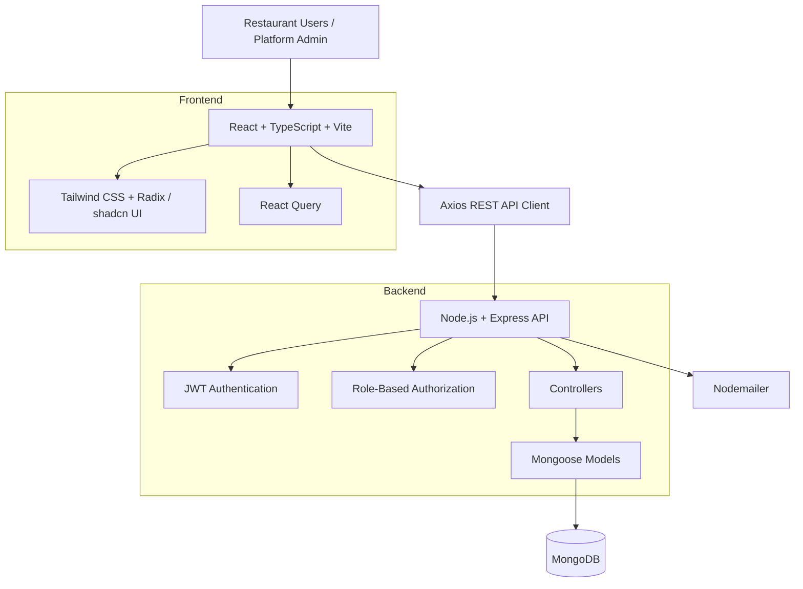
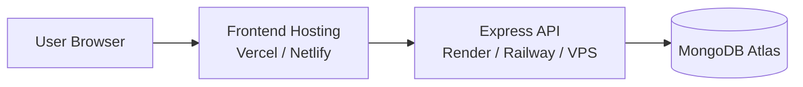

# Khao Peeo — Restaurant Management & POS Platform

<p align="center">
  <strong>A full-stack restaurant operations platform for managing tables, orders, kitchen workflows, billing, staff, and multi-restaurant administration.</strong>
</p>

<p align="center">
  <a href="#key-features">Features</a> •
  <a href="#architecture">Architecture</a> •
  <a href="#tech-stack">Tech Stack</a> •
  <a href="#getting-started">Getting Started</a> •
  <a href="#user-roles">User Roles</a> •
  <a href="#screenshots">Screenshots</a>
</p>

<p align="center">
  <a href="YOUR_DEPLOYMENT_URL">Live Demo</a> ·
  <a href="YOUR_GITHUB_REPOSITORY_URL">Repository</a>
</p>

---

## Overview

**Khao Peeo** is a role-based restaurant management and POS platform designed to centralize day-to-day restaurant operations into a single application.

Instead of managing tables, orders, kitchen communication, billing, and restaurant administration through separate tools, Khao Peeo provides dedicated workflows for each operational role.

The platform follows a **multi-tenant architecture**, where restaurant-specific data is isolated using `restaurantId`. Platform-level administrators can manage restaurants, while restaurant users operate within their assigned restaurant.

### Problem

Restaurants typically need to coordinate several operational workflows at the same time:

- Table availability and occupancy
- Order creation and tracking
- Kitchen order processing
- Food menu management
- Billing and payment status
- Staff access and role management
- Restaurant-level administration
- Platform-level restaurant management

Khao Peeo brings these workflows together through role-specific dashboards and a centralized REST API.

---

## Key Features

### Restaurant Operations

- Table creation, management, occupancy and current-order tracking
- Order creation against restaurant tables
- Order status lifecycle from creation to serving
- Menu item management with categories, pricing and availability
- Billing with subtotal, tax and total amount
- Served-order history for completed transactions
- Restaurant-specific configuration and branding support

### Kitchen Workflow

- Dedicated Kitchen Display System (KDS)
- New order queue
- Preparing orders
- Ready orders
- Status progression from `sent_to_kitchen` → `preparing` → `ready`
- Table-based order identification

### Staff & Access Control

- JWT-based authentication
- Role-based authorization
- Restaurant-scoped access
- Dedicated interfaces for:
  - Restaurant Owner
  - Restaurant Admin / Manager
  - Waiter
  - Kitchen Staff
  - Platform Super Admin

### Platform Administration

- Restaurant creation and management
- Restaurant owner information
- Restaurant status and plan management
- Platform-level restaurant overview
- Subscription model supporting:
  - Basic
  - Professional
  - Enterprise

### Frontend Experience

- Responsive dashboard interfaces
- React + TypeScript application
- Tailwind CSS based design system
- Radix/shadcn-style reusable UI components
- React Query for server-state management
- Axios API client with JWT authorization interceptor
- Toast notifications and loading/error states
- Light/dark theme support

---

## Architecture

Khao Peeo uses a **frontend–API–database architecture** with clear separation between presentation, business logic and persistence.



### Request Flow

```text
User
  ↓
React Dashboard
  ↓
Axios API Client
  ↓
Express Route
  ↓
JWT Authentication Middleware
  ↓
Role Authorization Middleware
  ↓
Controller / Business Logic
  ↓
Mongoose Model
  ↓
MongoDB
  ↓
JSON Response
  ↓
React Query / UI Update
```

### Multi-Tenant Data Isolation

Restaurant-owned resources contain a `restaurantId` reference.

```text
Platform
 ├── Restaurant A
 │    ├── Users
 │    ├── Tables
 │    ├── Menu
 │    ├── Orders
 │    ├── Bills
 │    └── Served Orders
 │
 └── Restaurant B
      ├── Users
      ├── Tables
      ├── Menu
      ├── Orders
      ├── Bills
      └── Served Orders
```

This allows the same backend to support multiple restaurants while keeping operational data scoped to the relevant restaurant.

---

## Tech Stack

| Layer | Technology |
|---|---|
| Frontend | React 18, TypeScript, Vite |
| Styling | Tailwind CSS |
| UI Components | Radix UI / shadcn-style components |
| State / Server State | TanStack React Query |
| HTTP Client | Axios |
| Routing | React Router |
| Forms / Validation | React Hook Form, Zod |
| Charts | Recharts |
| Backend | Node.js, Express.js |
| Database | MongoDB |
| ODM | Mongoose |
| Authentication | JWT |
| Password Security | bcryptjs |
| Email | Nodemailer |
| Logging | Morgan |
| Deployment | Frontend + Node.js API + MongoDB Atlas |

---

## User Roles

| Role | Responsibility |
|---|---|
| **Platform Super Admin** | Manage restaurants at the platform level |
| **Restaurant Owner** | Manage restaurant operations, tables, menu and staff |
| **Restaurant Admin / Manager** | Manage restaurant tables, orders and operational workflows |
| **Waiter** | Create orders, monitor active/ready orders and mark served |
| **Kitchen Staff** | Process incoming kitchen orders and update preparation status |

Authorization is enforced through JWT authentication and role-based middleware on protected backend routes.

---

## Core Modules

### 1. Authentication

- User login
- JWT token generation and verification
- Protected API routes
- Automatic unauthorized-session handling
- Role-based access control

### 2. Table Management

- Create tables
- Configure table capacity
- Track booking/occupancy
- Associate current orders with tables
- Restaurant-scoped table uniqueness

### 3. Menu Management

Menu items support:

- Name
- Category
- Subcategory
- Description
- Price
- Image
- Availability
- Vegetarian flag
- Preparation time
- Tags
- Customizations and additional pricing

### 4. Order Management

Orders contain:

- Restaurant
- Table
- Items
- Quantity
- Price
- Total amount
- Order type
- Current processing status
- Creating user

Order lifecycle:

```text
Order Created
      ↓
Sent to Kitchen
      ↓
Preparing
      ↓
Ready
      ↓
Served
```

### 5. Kitchen Display System

The KDS gives kitchen staff a focused operational interface:

```text
New Orders → Preparing → Ready
```

This reduces dependency on manual communication between waiters and kitchen staff.

### 6. Billing

Bills track:

- Order
- Table
- Subtotal
- Tax
- Total amount
- Payment status

Supported payment state:

```text
Pending → Paid
```

### 7. Restaurant Management

Restaurant records support:

- Restaurant identity
- Address
- Contact details
- GST/FSSAI information
- Business type
- Branding
- Currency
- Timezone
- Tax rates
- Business hours
- Operational status

### 8. Subscription Foundation

The backend includes a subscription model designed for SaaS expansion:

- Basic
- Professional
- Enterprise
- Monthly / yearly billing
- Trial periods
- Feature limits
- Payment history

---

## API Structure

The backend exposes REST endpoints grouped by domain:

```text
/api/auth
/api/tables
/api/orders
/api/bills
/api/menu
/api/restaurant
/api/served-orders
/api/platform
/api/superadmin
```

Health endpoint:

```text
GET /api/health
```

Example response:

```json
{
  "status": "ok",
  "message": "Khao Peeo backend running"
}
```

---

## Project Structure

```text
khao-peeo/
│
├── backend/
│   ├── config/
│   │   ├── db.js
│   │   └── env.js
│   │
│   ├── controllers/
│   │   ├── auth.controller.js
│   │   ├── bill.controller.js
│   │   ├── menu.controller.js
│   │   ├── order.controller.js
│   │   ├── platform.controller.js
│   │   ├── restaurant.controller.js
│   │   ├── servedOrder.controller.js
│   │   ├── superadmin.controller.js
│   │   └── table.controller.js
│   │
│   ├── middleware/
│   │   ├── auth.middleware.js
│   │   └── role.middleware.js
│   │
│   ├── models/
│   │   ├── Bill.model.js
│   │   ├── MenuItem.model.js
│   │   ├── Order.model.js
│   │   ├── Restaurant.model.js
│   │   ├── ServedOrder.model.js
│   │   ├── Subscription.model.js
│   │   ├── Table.model.js
│   │   └── User.model.js
│   │
│   ├── routes/
│   │   ├── auth.routes.js
│   │   ├── bill.routes.js
│   │   ├── menu.routes.js
│   │   ├── order.routes.js
│   │   ├── platform.routes.js
│   │   ├── restaurant.routes.js
│   │   ├── servedOrder.routes.js
│   │   ├── superadmin.routes.js
│   │   └── table.routes.js
│   │
│   ├── scripts/
│   ├── utils/
│   ├── app.js
│   └── server.js
│
├── frontend/
│   ├── public/
│   └── src/
│       ├── api/
│       ├── components/
│       ├── hooks/
│       ├── integrations/
│       ├── lib/
│       ├── pages/
│       ├── App.tsx
│       └── main.tsx
│
├── docs/
│   └── screenshots/
│
└── README.md
```

---

## Screenshots

### Manager — Live Attendance / Operations


### Owner — Attendance & Staff Monitoring


### Attendance History


### Manager Dashboard


> The screenshots demonstrate the role-based dashboard experience and the operational UI used for restaurant management.

---

## Getting Started

### Prerequisites

Make sure the following are installed:

- Node.js 18+
- npm
- MongoDB / MongoDB Atlas
- Git

### 1. Clone the Repository

```bash
git clone YOUR_GITHUB_REPOSITORY_URL
cd khao-peeo
```

### 2. Backend Setup

```bash
cd backend
npm install
```

Create a `.env` file:

```env
NODE_ENV=development
PORT=5000

MONGO_URI=your_mongodb_connection_string

JWT_SECRET=your_strong_jwt_secret

CLIENT_URL=http://localhost:5173
```

Start the backend:

```bash
npm run dev
```

The API will run on:

```text
http://localhost:5000
```

Health check:

```text
http://localhost:5000/api/health
```

### 3. Frontend Setup

Open another terminal:

```bash
cd frontend
npm install
```

Create a `.env` file:

```env
VITE_API_URL=http://localhost:5000/api
```

Start the frontend:

```bash
npm run dev
```

The frontend will normally be available at:

```text
http://localhost:5173
```

---

## Environment Variables

### Backend

| Variable | Description |
|---|---|
| `NODE_ENV` | Runtime environment |
| `PORT` | Express server port |
| `MONGO_URI` | MongoDB connection string |
| `JWT_SECRET` | Secret used to sign JWT tokens |
| `CLIENT_URL` | Frontend URL allowed by the API |

### Frontend

| Variable | Description |
|---|---|
| `VITE_API_URL` | Base URL of the backend API |

> Never commit `.env` files or production secrets to GitHub.

---

## Deployment

### Recommended Production Architecture



For the deployed project, update the links below:

- **Live Application:** `YOUR_DEPLOYMENT_URL`
- **Backend API:** `YOUR_BACKEND_URL`
- **API Health Check:** `YOUR_BACKEND_URL/api/health`

### Production Environment

Frontend:

```env
VITE_API_URL=https://YOUR_BACKEND_URL/api
```

Backend:

```env
NODE_ENV=production
PORT=5000
MONGO_URI=your_production_mongodb_uri
JWT_SECRET=your_production_secret
CLIENT_URL=https://YOUR_FRONTEND_URL
```

---

## Security

The application includes:

- JWT-based authentication
- Password hashing with bcrypt
- Protected API routes
- Role-based authorization middleware
- Restaurant-scoped resource access
- Environment-based secret configuration
- CORS configuration
- Centralized error handling

For production, secrets should be stored in the deployment provider's environment-variable manager rather than committed to source control.

---

## Engineering Highlights

This project demonstrates practical full-stack engineering concepts:

- REST API design
- Authentication and authorization
- Role-based access control
- Multi-tenant data modeling
- MongoDB schema design with Mongoose
- Frontend/backend separation
- Reusable React components
- Server-state management with React Query
- API abstraction through Axios
- Modular Express routing/controllers
- Database indexing for restaurant/table and menu lookups
- Operational workflow modeling
- SaaS-oriented subscription architecture
- Production-oriented environment configuration

---

## Future Improvements

Potential next-stage improvements include:

- Real-time order updates using WebSockets
- Advanced sales and revenue analytics
- Inventory and ingredient tracking
- QR-code based customer ordering
- Online payment gateway integration
- Receipt/printer integration
- Advanced attendance and payroll workflows
- Automated restaurant notifications
- Rate limiting and stronger API security
- Automated testing and CI/CD
- Audit logs
- Centralized observability and error monitoring

---

## Project Status

**Status:** Active Development

Khao Peeo is being developed as a full-stack restaurant management platform with a focus on practical restaurant workflows, role-based dashboards and SaaS-ready architecture.

---

## License

This project is private/proprietary software.

All rights reserved.

---

## Author

**Krish Baranwal**

Full-Stack Developer

If you are reviewing this project for hiring or collaboration, the repository demonstrates end-to-end ownership across frontend architecture, backend APIs, authentication, database modeling and deployment-oriented application design.
