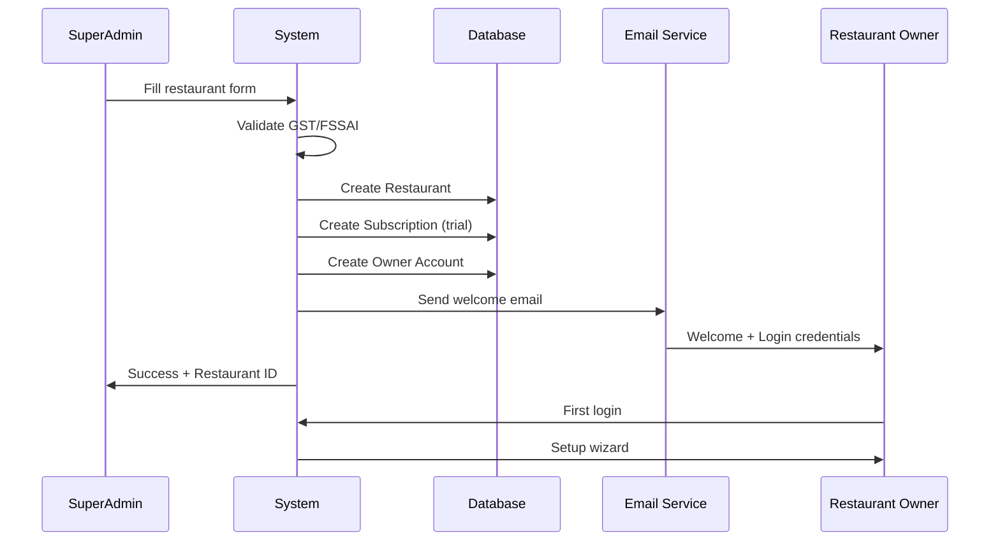

# Khao Peeo - Multi-Tenant SaaS Platform
## Product Requirements Document (PRD)

**Version:** 2.0  
**Date:** January 30, 2026  
**Status:** Planning Phase  
**Document Type:** Product Requirements Document

---

## Table of Contents

1. [Executive Summary](#executive-summary)
2. [Vision & Goals](#vision--goals)
3. [Current System vs. Target System](#current-system-vs-target-system)
4. [User Roles & Hierarchy](#user-roles--hierarchy)
5. [Core Features & Requirements](#core-features--requirements)
6. [Database Schema Changes](#database-schema-changes)
7. [API Endpoints Specification](#api-endpoints-specification)
8. [Authentication & Authorization Flow](#authentication--authorization-flow)
9. [Onboarding Flow](#onboarding-flow)
10. [Subscription & Billing Management](#subscription--billing-management)
11. [Feature Access Control](#feature-access-control)
12. [Implementation Phases](#implementation-phases)
13. [Technical Architecture Changes](#technical-architecture-changes)
14. [Security Considerations](#security-considerations)
15. [Scalability & Performance](#scalability--performance)
16. [UI/UX Requirements](#uiux-requirements)
17. [Testing Strategy](#testing-strategy)
18. [Migration Plan](#migration-plan)

---

## Executive Summary

### Problem Statement
Currently, Khao Peeo is built as a single-restaurant management system. To scale the business and offer it as a SaaS product (like PetPooja), we need to transform it into a **multi-tenant platform** where:
- One superadmin (you) can manage multiple restaurant clients
- Each restaurant is isolated with its own data
- Features can be enabled/disabled per restaurant
- Restaurant owners can manage their own staff and operations
- System can scale to hundreds of restaurant clients

### Solution Overview
Transform Khao Peeo into a three-tier hierarchy:
1. **Platform Level**: Superadmin manages all restaurants
2. **Restaurant Level**: Restaurant Owner/Admin manages their restaurant
3. **Staff Level**: Waiters and kitchen staff operate within their restaurant

### Key Objectives
- Support unlimited restaurants on single codebase
- Provide superadmin dashboard for platform management
- Enable restaurant-specific feature control
- Implement secure tenant isolation
- Create streamlined onboarding process
- Build subscription/billing management

---

## Vision & Goals

### Product Vision
"Become the leading restaurant POS SaaS platform in India, enabling 10,000+ restaurants to manage their operations efficiently with customizable features and affordable pricing."

### Business Goals
1. **Scale to 100+ restaurants in Year 1**
2. **Achieve 95% data isolation** between tenants
3. **Reduce onboarding time to <15 minutes**
4. **Enable self-service restaurant management**
5. **Support multiple pricing tiers**

### Technical Goals
1. **Multi-tenancy**: Single database with tenant isolation
2. **Scalability**: Support 1000+ concurrent restaurants
3. **Performance**: <2s page load for all dashboards
4. **Security**: Zero cross-tenant data leakage
5. **Maintainability**: Single codebase for all tenants

---

## Current System vs. Target System

### Current Architecture
```
Single Restaurant Instance
├── SuperAdmin (manages all users)
├── Owner (restaurant owner)
├── Admin (manager)
└── Waiter (staff)
```

**Limitations:**
- Only supports one restaurant
- No tenant isolation
- No restaurant-specific configuration
- No subscription management
- Cannot scale to multiple clients

### Target Architecture
```
SaaS Platform
├── Platform SuperAdmin (YOU - manages platform)
│   ├── Restaurant 1 (Sai Prakash Hotel)
│   │   ├── Restaurant Owner
│   │   ├── Restaurant Admin(s)
│   │   └── Waiter(s)
│   ├── Restaurant 2 (Another Client)
│   │   ├── Restaurant Owner
│   │   └── Staff...
│   └── Restaurant N...
```

**Capabilities:**
- Unlimited restaurants on single platform
- Complete data isolation per restaurant
- Restaurant-specific features and pricing
- Self-service restaurant management
- Centralized platform monitoring

---

## User Roles & Hierarchy

### New Role Structure

#### 1. Platform SuperAdmin (You)
**Level**: Platform  
**Scope**: All restaurants  
**Permissions**:
- Create/register new restaurants
- Assign restaurant owners
- Enable/disable restaurant access
- Configure restaurant features (per plan)
- View all restaurant analytics
- Manage platform settings
- Handle billing and subscriptions
- Access any restaurant's data (for support)
- Delete restaurants (with confirmation)

#### 2. Restaurant Owner
**Level**: Restaurant  
**Scope**: Single restaurant  
**Permissions**:
- Manage restaurant profile (name, address, GST, FSSAI)
- Create/manage admins and waiters
- Configure menu items and pricing
- View restaurant analytics
- Manage tables
- View all bills and orders
- Configure restaurant settings
- Cannot modify feature access (controlled by superadmin)

#### 3. Restaurant Admin
**Level**: Restaurant  
**Scope**: Single restaurant  
**Permissions**:
- Manage menu items and pricing
- Manage tables
- Create/manage waiters
- View orders and bills
- Access kitchen display
- Generate reports

#### 4. Restaurant Waiter
**Level**: Restaurant  
**Scope**: Single restaurant  
**Permissions**:
- Create orders
- Manage assigned tables
- Generate bills
- View kitchen status
- Update order status

### Permission Matrix

| Action | Platform SuperAdmin | Restaurant Owner | Restaurant Admin | Restaurant Waiter |
|--------|-------------------|------------------|------------------|-------------------|
| Create Restaurant | ✅ | ❌ | ❌ | ❌ |
| Configure Features | ✅ | ❌ | ❌ | ❌ |
| View All Restaurants | ✅ | ❌ | ❌ | ❌ |
| Manage Restaurant Profile | ✅ | ✅ | ❌ | ❌ |
| Manage Menu | ✅ | ✅ | ✅ | ❌ |
| Manage Tables | ✅ | ✅ | ✅ | ❌ |
| Create Users | ✅ | ✅ (own restaurant) | ✅ (waiters only) | ❌ |
| Create Orders | ✅ | ✅ | ✅ | ✅ |
| Generate Bills | ✅ | ✅ | ✅ | ✅ |
| View Analytics | ✅ (all) | ✅ (own) | ✅ (own) | ❌ |
| Disable Restaurant | ✅ | ❌ | ❌ | ❌ |

---

## Core Features & Requirements

### 1. Restaurant Registration System

#### 1.1 Superadmin Restaurant Creation
**User Story**: As a platform superadmin, I want to register new restaurants so that they can start using the system.

**Requirements**:
- Form to capture restaurant details:
  - Restaurant Name (required)
  - Restaurant Address (required)
  - City, State, Pincode
  - GST Number (required, validated)
  - FSSAI Number (required, validated)
  - Contact Number (required)
  - Email Address (required, unique)
  - Contact Person Name
- Auto-generate unique Restaurant ID/Slug
- Assign subscription plan during creation
- Enable/disable features per plan
- Create initial restaurant owner account
- Send welcome email with credentials

**Validation Rules**:
- GST Number: 15 characters, alphanumeric
- FSSAI Number: 14 digits
- Email: Valid format, unique across platform
- Phone: 10 digits
- Restaurant Name: Unique across platform

**Success Criteria**:
- Restaurant created in database
- Owner account created and activated
- Welcome email sent successfully
- Restaurant appears in superadmin dashboard

#### 1.2 Restaurant Profile Management
**User Story**: As a restaurant owner, I want to manage my restaurant details so that information stays current.

**Editable Fields** (by Restaurant Owner):
- Restaurant Name
- Address
- Contact Number
- Email
- Business Hours
- Logo Upload
- Tax Configuration (CGST/SGST rates)

**Non-Editable Fields** (only by Superadmin):
- GST Number
- FSSAI Number
- Restaurant ID
- Subscription Plan
- Active/Inactive Status

---

### 2. Multi-Tenant Data Isolation

#### 2.1 Tenant Identification
**Requirement**: Every request must identify the restaurant context.

**Implementation**:
- Add `restaurantId` field to User model
- Include `restaurantId` in JWT token payload
- All database queries filtered by `restaurantId`
- Middleware to enforce tenant context

#### 2.2 Data Segregation
**Requirement**: Complete isolation of restaurant data.

**Affected Collections**:
- Users (scoped to restaurant)
- Tables (scoped to restaurant)
- Orders (scoped to restaurant)
- Bills (scoped to restaurant)
- ServedOrders (scoped to restaurant)
- MenuItems (new - scoped to restaurant)

**Database Indexes**:
```javascript
// Compound indexes for performance
{ restaurantId: 1, tableNumber: 1 }
{ restaurantId: 1, createdAt: -1 }
{ restaurantId: 1, status: 1 }
```

---

### 3. Feature Access Control

#### 3.1 Feature Flags System
**Requirement**: Enable/disable features per restaurant based on subscription.

**Features to Control**:
- Number of tables allowed
- Number of staff accounts
- Advanced analytics
- Custom branding
- API access
- Multi-location support
- Inventory management (future)
- Online ordering integration (future)

**Feature Configuration Example**:
```javascript
{
  restaurantId: "rest_001",
  features: {
    maxTables: 20,
    maxStaff: 10,
    analytics: true,
    customBranding: false,
    apiAccess: false,
    multiLocation: false
  }
}
```

#### 3.2 Plan-Based Features

**Basic Plan** (₹999/month):
- Up to 10 tables
- Up to 5 staff accounts
- Basic billing
- Standard reports
- Email support

**Professional Plan** (₹1,999/month):
- Up to 30 tables
- Up to 15 staff accounts
- Advanced analytics
- Custom branding
- Priority support
- API access

**Enterprise Plan** (₹4,999/month):
- Unlimited tables
- Unlimited staff
- Multi-location support
- White-label solution
- Dedicated support
- Custom integrations

---

### 4. Subscription & Billing Management

#### 4.1 Subscription System
**Requirement**: Track and manage restaurant subscriptions.

**Subscription Model**:
```javascript
{
  restaurantId: ObjectId,
  plan: "basic" | "professional" | "enterprise",
  status: "active" | "trial" | "suspended" | "cancelled",
  currentPeriodStart: Date,
  currentPeriodEnd: Date,
  billingCycle: "monthly" | "yearly",
  amount: Number,
  currency: "INR",
  paymentMethod: String,
  autoRenew: Boolean,
  trialEndsAt: Date
}
```

#### 4.2 Trial Period
**Requirement**: Offer 14-day free trial for new restaurants.

**Implementation**:
- Auto-activate trial on restaurant creation
- Trial period: 14 days from registration
- Full feature access during trial
- Email reminders (7 days, 3 days, 1 day before expiry)
- Automatic suspension if not upgraded

#### 4.3 Payment Integration
**Future Requirement**: Integrate payment gateway for subscriptions.

**Options**:
- Razorpay
- Stripe
- PayU

**Features**:
- Auto-renewal
- Payment failure handling
- Invoice generation
- Payment history

---

### 5. Superadmin Dashboard

#### 5.1 Dashboard Overview
**Components**:

1. **Statistics Cards**:
   - Total Restaurants
   - Active Restaurants
   - Trial Restaurants
   - Total Revenue (MRR)

2. **Restaurant List**:
   - Name, Owner, Plan, Status
   - Created Date
   - Subscription Expiry
   - Quick Actions (Edit, Disable, View)

3. **Recent Activity**:
   - New registrations
   - Plan upgrades
   - Payment failures
   - Support tickets

4. **Revenue Analytics**:
   - Monthly Recurring Revenue (MRR)
   - Revenue by plan
   - Churn rate
   - Growth metrics

#### 5.2 Restaurant Management
**Features**:
- Create new restaurant
- View/edit restaurant details
- Disable/enable restaurant
- Change subscription plan
- View restaurant analytics
- Access restaurant as owner (impersonate)
- Send notifications to restaurant

---

### 6. Restaurant Onboarding Flow

#### 6.1 Initial Setup Wizard
**Requirement**: Guide restaurant owner through first-time setup.

**Steps**:

**Step 1: Welcome & Profile**
- Restaurant name, address, contact
- Upload logo (optional)
- Business hours

**Step 2: Basic Configuration**
- Tax rates (CGST/SGST)
- Currency preferences
- Default payment methods

**Step 3: Table Setup**
- Number of tables
- Table numbers and capacity
- Table layout (optional)

**Step 4: Menu Setup**
- Add menu categories
- Add menu items with prices
- Upload menu images (optional)

**Step 5: Staff Creation**
- Add admin users
- Add waiter accounts
- Set permissions

**Step 6: Training & Resources**
- Video tutorials
- Documentation links
- Support contact

#### 6.2 Progress Tracking
**Requirement**: Show setup completion percentage.

**Completion Criteria**:
- Profile completed (20%)
- Tables added (20%)
- Menu added (20%)
- Staff added (20%)
- First order created (20%)

---

### 7. Menu Management System (New Feature)

#### 7.1 Menu Structure
**Requirement**: Allow restaurants to manage their menu items.

**Menu Model**:
```javascript
{
  restaurantId: ObjectId,
  name: String,
  category: String,
  description: String,
  price: Number,
  image: String, // URL
  isAvailable: Boolean,
  isVeg: Boolean,
  preparationTime: Number, // minutes
  customizations: [{
    name: String,
    options: [String],
    priceModifier: Number
  }],
  createdAt: Date,
  updatedAt: Date
}
```

#### 7.2 Categories
**Predefined Categories**:
- Starters
- Main Course
- Breads
- Rice & Biryani
- Desserts
- Beverages
- Chinese
- Continental

**Custom Categories**: Allow restaurant to add custom categories

#### 7.3 Menu Features
- Bulk upload via CSV
- Image upload for items
- Mark items as available/unavailable
- Seasonal menu support
- Price history tracking

---

## Database Schema Changes

### New Collections

#### 1. Restaurant Collection
```javascript
{
  _id: ObjectId,
  restaurantId: String, // unique, e.g., "rest_001"
  name: String,
  slug: String, // URL-friendly name
  address: {
    street: String,
    city: String,
    state: String,
    pincode: String,
    country: String
  },
  contact: {
    phone: String,
    email: String,
    contactPerson: String
  },
  business: {
    gstNumber: String,
    fssaiNumber: String,
    businessType: String, // "cafe", "restaurant", "quick-service"
  },
  branding: {
    logo: String, // URL
    primaryColor: String,
    secondaryColor: String
  },
  settings: {
    currency: String,
    timezone: String,
    taxRates: {
      cgst: Number,
      sgst: Number,
      serviceCharge: Number
    },
    businessHours: {
      monday: { open: String, close: String, isClosed: Boolean },
      tuesday: { open: String, close: String, isClosed: Boolean },
      // ... other days
    }
  },
  status: {
    type: String,
    enum: ["active", "suspended", "trial", "inactive"],
    default: "trial"
  },
  createdBy: ObjectId, // SuperAdmin who created this
  createdAt: Date,
  updatedAt: Date
}
```

#### 2. Subscription Collection
```javascript
{
  _id: ObjectId,
  restaurantId: ObjectId,
  plan: {
    type: String,
    enum: ["basic", "professional", "enterprise"],
    default: "basic"
  },
  status: {
    type: String,
    enum: ["active", "trial", "suspended", "cancelled", "expired"],
    default: "trial"
  },
  billing: {
    cycle: String, // "monthly", "yearly"
    amount: Number,
    currency: String,
    nextBillingDate: Date
  },
  trial: {
    startDate: Date,
    endDate: Date,
    isTrialActive: Boolean
  },
  features: {
    maxTables: Number,
    maxStaff: Number,
    analytics: Boolean,
    customBranding: Boolean,
    apiAccess: Boolean,
    multiLocation: Boolean
  },
  paymentHistory: [{
    amount: Number,
    date: Date,
    status: String, // "success", "failed", "pending"
    invoiceUrl: String
  }],
  createdAt: Date,
  updatedAt: Date
}
```

#### 3. MenuItem Collection (New)
```javascript
{
  _id: ObjectId,
  restaurantId: ObjectId,
  name: String,
  category: String,
  subcategory: String,
  description: String,
  price: Number,
  image: String,
  isAvailable: Boolean,
  isVeg: Boolean,
  preparationTime: Number,
  customizations: [{
    name: String,
    options: [{
      name: String,
      price: Number
    }],
    isRequired: Boolean
  }],
  tags: [String], // "spicy", "chef-special", etc.
  createdBy: ObjectId,
  createdAt: Date,
  updatedAt: Date
}
```

### Modified Collections

#### Updated User Model
```javascript
{
  _id: ObjectId,
  restaurantId: ObjectId, // NEW FIELD - links user to restaurant
  fullName: String,
  email: String,
  password: String,
  role: {
    type: String,
    enum: ["platform_superadmin", "restaurant_owner", "restaurant_admin", "waiter"],
    // "platform_superadmin" is new role
  },
  isOnline: Boolean,
  lastLogin: Date,
  lastActivity: Date,
  permissions: {
    canManageMenu: Boolean,
    canManageTables: Boolean,
    canManageStaff: Boolean,
    canViewReports: Boolean
  },
  createdBy: ObjectId,
  createdAt: Date,
  updatedAt: Date
}

// Compound Index
db.users.createIndex({ restaurantId: 1, email: 1 }, { unique: true })
```

#### Updated Table Model
```javascript
{
  _id: ObjectId,
  restaurantId: ObjectId, // NEW FIELD
  tableNumber: Number,
  capacity: Number,
  section: String, // "indoor", "outdoor", "terrace"
  isBooked: Boolean,
  currentOrder: ObjectId,
  qrCode: String, // for QR code ordering (future)
  createdAt: Date,
  updatedAt: Date
}

// Compound Index
db.tables.createIndex({ restaurantId: 1, tableNumber: 1 }, { unique: true })
```

#### Updated Order Model
```javascript
{
  _id: ObjectId,
  restaurantId: ObjectId, // NEW FIELD
  table: ObjectId,
  items: [{
    menuItem: ObjectId, // reference to MenuItem
    name: String,
    quantity: Number,
    price: Number,
    customizations: [String],
    totalPrice: Number
  }],
  totalAmount: Number,
  status: String,
  createdBy: ObjectId,
  notes: String,
  createdAt: Date,
  updatedAt: Date
}

// Index
db.orders.createIndex({ restaurantId: 1, status: 1, createdAt: -1 })
```

#### Updated Bill Model
```javascript
{
  _id: ObjectId,
  restaurantId: ObjectId, // NEW FIELD
  order: ObjectId,
  table: ObjectId,
  items: [{
    name: String,
    quantity: Number,
    price: Number,
    totalPrice: Number
  }],
  subtotal: Number,
  tax: {
    cgst: Number,
    sgst: Number,
    total: Number
  },
  serviceCharge: Number,
  discount: Number,
  totalAmount: Number,
  paymentMethod: String,
  paidAt: Date,
  servedBy: ObjectId,
  createdAt: Date
}

// Index
db.bills.createIndex({ restaurantId: 1, createdAt: -1 })
```

---

## API Endpoints Specification

### Platform SuperAdmin APIs

#### Restaurant Management

**POST /api/superadmin/restaurants**
```javascript
// Create new restaurant
Request Body:
{
  name: "Sai Prakash Hotel",
  address: {
    street: "123 Main Street",
    city: "Mumbai",
    state: "Maharashtra",
    pincode: "400001"
  },
  contact: {
    phone: "9876543210",
    email: "saiprakash@example.com",
    contactPerson: "Sai Prakash"
  },
  business: {
    gstNumber: "27AABCU9603R1ZX",
    fssaiNumber: "12345678901234"
  },
  plan: "professional",
  owner: {
    fullName: "Sai Prakash",
    email: "owner@saiprakash.com",
    password: "auto-generated-or-provided"
  }
}

Response:
{
  success: true,
  data: {
    restaurant: { ...restaurantDetails },
    owner: { ...ownerDetails },
    subscription: { ...subscriptionDetails }
  },
  message: "Restaurant created successfully"
}
```

**GET /api/superadmin/restaurants**
```javascript
// Get all restaurants
Query Params:
- status: "active" | "trial" | "suspended" | "all"
- plan: "basic" | "professional" | "enterprise"
- page: number
- limit: number
- search: string

Response:
{
  success: true,
  data: {
    restaurants: [...],
    pagination: {
      total: 45,
      page: 1,
      pages: 5,
      limit: 10
    },
    stats: {
      total: 45,
      active: 38,
      trial: 5,
      suspended: 2
    }
  }
}
```

**GET /api/superadmin/restaurants/:id**
```javascript
// Get restaurant details
Response:
{
  success: true,
  data: {
    restaurant: { ...details },
    subscription: { ...details },
    stats: {
      totalOrders: 1250,
      totalRevenue: 125000,
      activeStaff: 8,
      activeTables: 15
    },
    recentActivity: [...]
  }
}
```

**PATCH /api/superadmin/restaurants/:id**
```javascript
// Update restaurant
Request Body:
{
  status: "active" | "suspended",
  // or other fields to update
}

Response:
{
  success: true,
  data: { ...updatedRestaurant },
  message: "Restaurant updated successfully"
}
```

**DELETE /api/superadmin/restaurants/:id**
```javascript
// Delete restaurant (soft delete)
Response:
{
  success: true,
  message: "Restaurant deleted successfully"
}
```

#### Subscription Management

**PATCH /api/superadmin/restaurants/:id/subscription**
```javascript
// Update subscription plan
Request Body:
{
  plan: "professional",
  billingCycle: "monthly" | "yearly",
  features: {
    maxTables: 30,
    maxStaff: 15,
    analytics: true
  }
}

Response:
{
  success: true,
  data: { ...updatedSubscription },
  message: "Subscription updated successfully"
}
```

**POST /api/superadmin/restaurants/:id/subscription/extend-trial**
```javascript
// Extend trial period
Request Body:
{
  days: 7
}

Response:
{
  success: true,
  data: {
    newTrialEndDate: "2026-02-15T00:00:00.000Z"
  }
}
```

#### Analytics

**GET /api/superadmin/analytics/overview**
```javascript
// Platform-wide analytics
Response:
{
  success: true,
  data: {
    totalRestaurants: 45,
    activeRestaurants: 38,
    trialRestaurants: 5,
    mrr: 75000, // Monthly Recurring Revenue
    revenueByPlan: {
      basic: 25000,
      professional: 35000,
      enterprise: 15000
    },
    newSignups: {
      today: 2,
      thisWeek: 8,
      thisMonth: 24
    },
    churnRate: 3.5
  }
}
```

### Restaurant Owner APIs

#### Restaurant Profile

**GET /api/restaurant/profile**
```javascript
// Get own restaurant profile
Response:
{
  success: true,
  data: {
    restaurant: { ...details },
    subscription: { ...details }
  }
}
```

**PATCH /api/restaurant/profile**
```javascript
// Update restaurant profile
Request Body:
{
  name: "Updated Name",
  address: { ... },
  contact: { ... },
  settings: { ... }
}

Response:
{
  success: true,
  data: { ...updatedRestaurant }
}
```

#### Staff Management

**POST /api/restaurant/staff**
```javascript
// Create staff member
Request Body:
{
  fullName: "John Doe",
  email: "john@saiprakash.com",
  role: "waiter" | "restaurant_admin",
  permissions: {
    canManageMenu: false,
    canManageTables: true,
    canViewReports: false
  }
}

Response:
{
  success: true,
  data: { ...staffDetails },
  message: "Staff member created successfully"
}
```

**GET /api/restaurant/staff**
```javascript
// Get all staff in restaurant
Response:
{
  success: true,
  data: {
    staff: [...],
    stats: {
      total: 8,
      online: 5,
      byRole: {
        restaurant_admin: 2,
        waiter: 6
      }
    }
  }
}
```

#### Menu Management

**POST /api/restaurant/menu**
```javascript
// Create menu item
Request Body:
{
  name: "Butter Chicken",
  category: "Main Course",
  price: 350,
  description: "Creamy tomato-based curry",
  isVeg: false,
  preparationTime: 20,
  image: "url-to-image"
}

Response:
{
  success: true,
  data: { ...menuItem },
  message: "Menu item created successfully"
}
```

**GET /api/restaurant/menu**
```javascript
// Get all menu items
Query Params:
- category: string
- isAvailable: boolean
- search: string

Response:
{
  success: true,
  data: {
    items: [...],
    categories: ["Starters", "Main Course", ...]
  }
}
```

**PATCH /api/restaurant/menu/:id**
```javascript
// Update menu item
Request Body:
{
  price: 375,
  isAvailable: false
}

Response:
{
  success: true,
  data: { ...updatedMenuItem }
}
```

### Modified Existing APIs

All existing APIs need to be modified to include restaurant context:

**Authentication**
- JWT token includes `restaurantId`
- Login validates user belongs to active restaurant

**Orders, Tables, Bills**
- All queries filtered by `restaurantId` from token
- Cannot access data from other restaurants

---

## Authentication & Authorization Flow

### 1. Platform SuperAdmin Login
```
1. User logs in with email/password
2. System validates credentials
3. Checks role = "platform_superadmin"
4. Generates JWT with:
   {
     userId: "...",
     role: "platform_superadmin",
     restaurantId: null // SuperAdmin not tied to restaurant
   }
5. Returns token + user details
6. Redirect to SuperAdmin Dashboard
```

### 2. Restaurant User Login
```
1. User logs in with email/password
2. System validates credentials
3. Checks user's restaurant status (must be "active" or "trial")
4. Generates JWT with:
   {
     userId: "...",
     role: "restaurant_owner" | "restaurant_admin" | "waiter",
     restaurantId: "rest_001"
   }
5. Returns token + user details + restaurant details
6. Redirect to role-specific dashboard
```

### 3. Middleware Architecture

```javascript
// middleware/auth.js
const authenticate = async (req, res, next) => {
  // Verify JWT token
  // Attach user and restaurantId to req
}

// middleware/tenant.js
const tenantContext = async (req, res, next) => {
  // For non-superadmin users
  // Validate restaurant is active
  // Attach restaurant to req
}

// middleware/checkFeature.js
const checkFeature = (featureName) => {
  return async (req, res, next) => {
    // Check if restaurant's plan includes this feature
    // Allow or deny access
  }
}

// Usage
router.post('/orders',
  authenticate,
  tenantContext,
  checkFeature('advancedOrdering'),
  orderController.create
);
```

### 4. Role-Based Access Control (RBAC)

```javascript
// middleware/authorize.js
const authorize = (...allowedRoles) => {
  return (req, res, next) => {
    if (!allowedRoles.includes(req.user.role)) {
      return res.status(403).json({
        success: false,
        message: "You don't have permission to perform this action"
      });
    }
    next();
  };
};

// Usage
router.post('/restaurants',
  authenticate,
  authorize('platform_superadmin'),
  restaurantController.create
);

router.post('/menu',
  authenticate,
  tenantContext,
  authorize('restaurant_owner', 'restaurant_admin'),
  menuController.create
);
```

---

## Onboarding Flow

### SuperAdmin Onboarding New Restaurant



### Steps in Detail:

#### Step 1: SuperAdmin Creates Restaurant
- Navigate to "Add Restaurant"
- Fill form with restaurant details
- Select initial plan
- System validates:
  - GST format and uniqueness
  - FSSAI format and uniqueness
  - Email uniqueness
  - Phone format
- Submit

#### Step 2: System Processing
- Generate unique `restaurantId`
- Create Restaurant document
- Create Subscription document:
  - Status: "trial"
  - Trial end date: +14 days
  - Features: Based on selected plan
- Generate owner credentials:
  - Auto-generate secure password
  - Create User document with role "restaurant_owner"
- Send welcome email

#### Step 3: Owner Receives Email
Email contains:
- Welcome message
- Login credentials (email + temporary password)
- Link to login page
- Link to setup wizard
- Support contact

#### Step 4: Owner First Login
- Owner logs in with temporary password
- Prompted to change password
- Redirect to Setup Wizard

#### Step 5: Setup Wizard
**Page 1: Welcome**
- Introduction
- Video tutorial
- Continue button

**Page 2: Profile**
- Upload logo
- Set business hours
- Configure tax rates
- Continue

**Page 3: Tables**
- Add tables (number, capacity, section)
- Bulk add option
- Continue

**Page 4: Menu**
- Add categories
- Add menu items
- Bulk upload CSV option
- Skip for now option

**Page 5: Staff**
- Add admins
- Add waiters
- Set permissions
- Skip for now option

**Page 6: Complete**
- Summary of setup
- Training resources
- Go to Dashboard button

---

## Subscription & Billing Management

### Trial Management

#### Auto-Trial Activation
```javascript
// When restaurant is created
subscription = {
  status: "trial",
  plan: selectedPlan,
  trial: {
    startDate: new Date(),
    endDate: new Date(+14 days),
    isTrialActive: true
  }
}
```

#### Trial Expiry Notifications
```javascript
// Cron job runs daily
checkTrialExpiry() {
  // Find trials expiring in 7 days
  // Send email: "7 days left in trial"
  
  // Find trials expiring in 3 days
  // Send email: "3 days left - subscribe now"
  
  // Find trials expiring in 1 day
  // Send email: "Last day of trial"
  
  // Find expired trials
  // Update status to "expired"
  // Disable restaurant access
  // Send email: "Trial expired - subscribe to continue"
}
```

### Subscription Plans

#### Plan Configuration
```javascript
const PLANS = {
  basic: {
    name: "Basic",
    price: 999,
    features: {
      maxTables: 10,
      maxStaff: 5,
      analytics: false,
      customBranding: false,
      apiAccess: false,
      multiLocation: false
    },
    limits: {
      ordersPerMonth: 1000,
      billsPerMonth: 1000
    }
  },
  professional: {
    name: "Professional",
    price: 1999,
    features: {
      maxTables: 30,
      maxStaff: 15,
      analytics: true,
      customBranding: false,
      apiAccess: true,
      multiLocation: false
    },
    limits: {
      ordersPerMonth: 5000,
      billsPerMonth: 5000
    }
  },
  enterprise: {
    name: "Enterprise",
    price: 4999,
    features: {
      maxTables: -1, // unlimited
      maxStaff: -1, // unlimited
      analytics: true,
      customBranding: true,
      apiAccess: true,
      multiLocation: true
    },
    limits: {
      ordersPerMonth: -1, // unlimited
      billsPerMonth: -1 // unlimited
    }
  }
};
```

#### Feature Enforcement

```javascript
// middleware/checkLimits.js
const checkTableLimit = async (req, res, next) => {
  const restaurant = req.restaurant;
  const subscription = await Subscription.findOne({ restaurantId: restaurant._id });
  const currentTableCount = await Table.countDocuments({ restaurantId: restaurant._id });
  
  if (subscription.features.maxTables !== -1 && 
      currentTableCount >= subscription.features.maxTables) {
    return res.status(403).json({
      success: false,
      message: `Table limit reached. Upgrade to add more tables.`,
      upgrade: true
    });
  }
  
  next();
};

// Usage
router.post('/tables',
  authenticate,
  tenantContext,
  checkTableLimit,
  tableController.create
);
```

### Payment Integration (Future)

#### Payment Flow
```
1. Restaurant owner clicks "Upgrade" or "Subscribe"
2. Select plan and billing cycle
3. Redirect to Razorpay checkout
4. User completes payment
5. Razorpay webhook notifies system
6. System updates subscription:
   - Status: "active"
   - Update features
   - Set next billing date
7. Send confirmation email
8. Redirect to dashboard
```

#### Payment Webhook
```javascript
// POST /api/webhooks/razorpay
router.post('/razorpay', async (req, res) => {
  // Verify webhook signature
  // Extract payment details
  // Update subscription
  // Send confirmation email
  // Update restaurant status to "active"
});
```

---

## Feature Access Control

### Implementation Pattern

```javascript
// models/Subscription.js
subscriptionSchema.methods.hasFeature = function(featureName) {
  return this.features[featureName] === true;
};

subscriptionSchema.methods.isWithinLimit = async function(limitType) {
  const limit = this.features[limitType];
  if (limit === -1) return true; // unlimited
  
  const count = await getCount(this.restaurantId, limitType);
  return count < limit;
};

// In controller
const createTable = async (req, res) => {
  const subscription = await Subscription.findOne({ 
    restaurantId: req.restaurant._id 
  });
  
  if (!await subscription.isWithinLimit('maxTables')) {
    return res.status(403).json({
      success: false,
      message: "Table limit reached",
      currentPlan: subscription.plan,
      suggestUpgrade: true
    });
  }
  
  // Create table...
};
```

### Feature Gates in Frontend

```javascript
// hooks/useFeatures.js
export const useFeatures = () => {
  const { data: subscription } = useQuery({
    queryKey: ['subscription'],
    queryFn: fetchSubscription
  });
  
  return {
    hasFeature: (featureName) => subscription?.features[featureName],
    canAddTable: subscription?.stats?.currentTables < subscription?.features?.maxTables,
    canAddStaff: subscription?.stats?.currentStaff < subscription?.features?.maxStaff,
    // ... other checks
  };
};

// In component
const TableList = () => {
  const { canAddTable, hasFeature } = useFeatures();
  
  return (
    <div>
      <Button 
        disabled={!canAddTable}
        onClick={handleAddTable}
      >
        Add Table
        {!canAddTable && " (Limit Reached)"}
      </Button>
      
      {hasFeature('analytics') && (
        <AnalyticsSection />
      )}
    </div>
  );
};
```

---

## Implementation Phases

### Phase 1: Foundation (Weeks 1-3)
**Goal**: Setup multi-tenancy infrastructure

**Tasks**:
1. **Database Schema**
   - Create Restaurant model
   - Create Subscription model
   - Add restaurantId to all existing models
   - Create indexes
   - Write migration script

2. **Authentication Updates**
   - Add platform_superadmin role
   - Update JWT to include restaurantId
   - Create tenant middleware
   - Update all existing auth flows

3. **Basic SuperAdmin Dashboard**
   - Login page
   - Restaurant list page
   - Create restaurant form
   - View restaurant details

**Deliverables**:
- Multi-tenant database structure
- SuperAdmin can create restaurants
- Users can login to their restaurant
- Basic data isolation working

---

### Phase 2: Restaurant Management (Weeks 4-6)
**Goal**: Complete restaurant CRUD and profile management

**Tasks**:
1. **Restaurant Profile**
   - Create profile page for owners
   - Edit restaurant details
   - Upload logo
   - Configure settings

2. **Staff Management**
   - Create staff
   - Edit staff
   - Delete staff
   - Set permissions

3. **Subscription System**
   - Create Subscription model
   - Implement trial logic
   - Plan configuration
   - Feature flags basic implementation

**Deliverables**:
- Restaurant owners can manage profile
- Restaurant owners can manage staff
- Trial period works
- Basic feature restrictions work

---

### Phase 3: Menu System (Weeks 7-8)
**Goal**: Add menu management capabilities

**Tasks**:
1. **Menu Model & APIs**
   - Create MenuItem model
   - CRUD APIs for menu
   - Category management

2. **Menu UI**
   - Menu list page
   - Add menu item form
   - Edit menu item
   - Bulk upload CSV
   - Image upload

3. **Integration**
   - Update order creation to use menu
   - Update bill generation
   - Update kitchen display

**Deliverables**:
- Complete menu management
- Orders linked to menu items
- Kitchen display shows menu items

---

### Phase 4: Feature Control (Weeks 9-10)
**Goal**: Implement plan-based feature restrictions

**Tasks**:
1. **Feature Middleware**
   - Table limit enforcement
   - Staff limit enforcement
   - Feature gate middleware

2. **UI Updates**
   - Show upgrade prompts
   - Disable features not in plan
   - Display current plan info

3. **Analytics (Pro feature)**
   - Revenue charts
   - Order trends
   - Popular items
   - Staff performance

**Deliverables**:
- All limits enforced
- Upgrade prompts working
- Analytics available for Pro+ plans

---

### Phase 5: Onboarding & UX (Weeks 11-12)
**Goal**: Smooth onboarding experience

**Tasks**:
1. **Setup Wizard**
   - Multi-step wizard
   - Progress tracking
   - Skip options
   - Completion celebration

2. **Email System**
   - Welcome emails
   - Trial expiry reminders
   - Payment reminders
   - Activity notifications

3. **Documentation**
   - User guide
   - Video tutorials
   - FAQ section
   - Support system

**Deliverables**:
- Complete setup wizard
- Email notifications
- Help documentation

---

### Phase 6: Polish & Launch (Weeks 13-14)
**Goal**: Production-ready system

**Tasks**:
1. **Testing**
   - Unit tests
   - Integration tests
   - End-to-end tests
   - Security audit

2. **Performance**
   - Database optimization
   - Query optimization
   - Caching
   - Load testing

3. **Deployment**
   - Production setup
   - CI/CD pipeline
   - Monitoring
   - Backup system

**Deliverables**:
- Production-ready system
- All tests passing
- Monitoring active
- Documentation complete

---

## Technical Architecture Changes

### Backend Changes

#### 1. Project Structure
```
backend/
├── config/
│   ├── database.js
│   ├── plans.js          # NEW - Plan configurations
│   └── features.js       # NEW - Feature flags
├── middleware/
│   ├── auth.js
│   ├── tenant.js         # NEW - Tenant context
│   ├── authorize.js      # UPDATED - Multi-level RBAC
│   ├── checkFeature.js   # NEW - Feature gate
│   └── checkLimit.js     # NEW - Limit enforcement
├── models/
│   ├── Restaurant.js     # NEW
│   ├── Subscription.js   # NEW
│   ├── MenuItem.js       # NEW
│   ├── User.js           # UPDATED
│   ├── Table.js          # UPDATED
│   ├── Order.js          # UPDATED
│   └── Bill.js           # UPDATED
├── controllers/
│   ├── superadmin/
│   │   ├── restaurant.js # NEW
│   │   ├── analytics.js  # NEW
│   │   └── subscription.js # NEW
│   ├── restaurant/
│   │   ├── profile.js    # NEW
│   │   ├── staff.js      # NEW
│   │   └── menu.js       # NEW
│   └── ... (existing)
├── routes/
│   ├── superadmin.js     # NEW
│   ├── restaurant.js     # NEW
│   └── ... (existing - all UPDATED)
└── services/
    ├── email.js          # NEW
    ├── notification.js   # NEW
    └── subscription.js   # NEW
```

#### 2. Migration Strategy

```javascript
// scripts/migrate-to-multitenant.js

/**
 * Migration Steps:
 * 1. Create default restaurant for existing data
 * 2. Add restaurantId to all existing documents
 * 3. Create default subscription
 * 4. Update user roles
 * 5. Create indexes
 */

const migrateToMultitenant = async () => {
  // Create default restaurant
  const defaultRestaurant = await Restaurant.create({
    restaurantId: "rest_default",
    name: "Khao Peeo Restaurant",
    // ... other details
    status: "active"
  });
  
  // Create subscription
  await Subscription.create({
    restaurantId: defaultRestaurant._id,
    plan: "enterprise",
    status: "active",
    features: PLANS.enterprise.features
  });
  
  // Update all users
  await User.updateMany(
    {},
    { 
      $set: { restaurantId: defaultRestaurant._id },
      $rename: { role: "oldRole" }
    }
  );
  
  // Map old roles to new roles
  await User.updateMany(
    { oldRole: "superadmin" },
    { $set: { role: "restaurant_owner" } }
  );
  
  // Update all tables
  await Table.updateMany(
    {},
    { $set: { restaurantId: defaultRestaurant._id } }
  );
  
  // Update all orders
  await Order.updateMany(
    {},
    { $set: { restaurantId: defaultRestaurant._id } }
  );
  
  // Update all bills
  await Bill.updateMany(
    {},
    { $set: { restaurantId: defaultRestaurant._id } }
  );
  
  // Create indexes
  await createIndexes();
  
  console.log("Migration completed successfully");
};
```

### Frontend Changes

#### 1. Project Structure
```
frontend/src/
├── components/
│   ├── superadmin/       # NEW
│   │   ├── RestaurantList.jsx
│   │   ├── CreateRestaurant.jsx
│   │   ├── RestaurantDetails.jsx
│   │   └── PlatformAnalytics.jsx
│   ├── restaurant/       # NEW
│   │   ├── ProfileSettings.jsx
│   │   ├── StaffManagement.jsx
│   │   ├── MenuManagement.jsx
│   │   └── SetupWizard.jsx
│   └── ... (existing)
├── pages/
│   ├── superadmin/       # NEW
│   │   ├── Dashboard.jsx
│   │   └── Restaurants.jsx
│   ├── restaurant/       # NEW
│   │   ├── Settings.jsx
│   │   └── Setup.jsx
│   └── ... (existing)
├── hooks/
│   ├── useRestaurant.js  # NEW
│   ├── useFeatures.js    # NEW
│   └── useSubscription.js # NEW
├── contexts/
│   └── RestaurantContext.jsx # NEW
└── lib/
    ├── api/
    │   ├── superadmin.js # NEW
    │   └── restaurant.js # NEW
    └── ... (existing)
```

#### 2. Context for Restaurant

```javascript
// contexts/RestaurantContext.jsx
export const RestaurantContext = createContext();

export const RestaurantProvider = ({ children }) => {
  const [restaurant, setRestaurant] = useState(null);
  const [subscription, setSubscription] = useState(null);
  
  useEffect(() => {
    if (user && user.role !== 'platform_superadmin') {
      fetchRestaurantData();
    }
  }, [user]);
  
  const fetchRestaurantData = async () => {
    const res = await api.get('/restaurant/profile');
    setRestaurant(res.data.restaurant);
    setSubscription(res.data.subscription);
  };
  
  return (
    <RestaurantContext.Provider value={{ 
      restaurant, 
      subscription,
      refetch: fetchRestaurantData
    }}>
      {children}
    </RestaurantContext.Provider>
  );
};
```

#### 3. Feature Gates

```javascript
// components/common/FeatureGate.jsx
export const FeatureGate = ({ feature, children, fallback }) => {
  const { subscription } = useRestaurant();
  
  if (!subscription?.features[feature]) {
    return fallback || (
      <UpgradePrompt feature={feature} />
    );
  }
  
  return children;
};

// Usage
<FeatureGate 
  feature="analytics"
  fallback={<div>Upgrade to Pro for Analytics</div>}
>
  <AnalyticsDashboard />
</FeatureGate>
```

---

## Security Considerations

### 1. Tenant Isolation

**Critical Rules**:
- NEVER trust client-side restaurantId
- ALWAYS get restaurantId from JWT token
- ALWAYS filter queries by restaurantId
- NEVER allow cross-tenant data access

**Implementation**:
```javascript
// Bad ❌
const orders = await Order.find({ _id: req.params.id });

// Good ✅
const orders = await Order.find({ 
  _id: req.params.id,
  restaurantId: req.user.restaurantId 
});

// Even Better ✅✅
const orders = await Order.findOne({ 
  _id: req.params.id,
  restaurantId: req.restaurant._id 
});
```

### 2. Role Hierarchy Enforcement

```javascript
// Users can only manage users in same or lower hierarchy
const canManageUser = (actor, target) => {
  const hierarchy = {
    'platform_superadmin': 4,
    'restaurant_owner': 3,
    'restaurant_admin': 2,
    'waiter': 1
  };
  
  return hierarchy[actor.role] > hierarchy[target.role];
};
```

### 3. SuperAdmin Access Logging

```javascript
// Log all superadmin actions on restaurants
const logSuperadminAction = async (action, restaurantId, details) => {
  await AuditLog.create({
    action,
    restaurantId,
    performedBy: req.user._id,
    details,
    timestamp: new Date()
  });
};

// Usage
router.patch('/restaurants/:id/subscription', 
  authenticate,
  authorize('platform_superadmin'),
  async (req, res) => {
    // Update subscription...
    await logSuperadminAction('subscription_updated', req.params.id, req.body);
  }
);
```

### 4. Data Export Restrictions

```javascript
// Prevent bulk data extraction
const EXPORT_LIMITS = {
  orders: 1000,
  bills: 1000,
  customers: 5000
};

router.get('/export/orders', async (req, res) => {
  const count = await Order.countDocuments({ 
    restaurantId: req.restaurant._id 
  });
  
  if (count > EXPORT_LIMITS.orders) {
    return res.status(400).json({
      success: false,
      message: "Too many records. Please contact support for bulk export."
    });
  }
  
  // Proceed with export...
});
```

---

## Scalability & Performance

### 1. Database Optimization

#### Indexes
```javascript
// Critical indexes for multi-tenancy
db.users.createIndex({ restaurantId: 1, email: 1 }, { unique: true });
db.tables.createIndex({ restaurantId: 1, tableNumber: 1 }, { unique: true });
db.orders.createIndex({ restaurantId: 1, status: 1, createdAt: -1 });
db.bills.createIndex({ restaurantId: 1, createdAt: -1 });
db.menuItems.createIndex({ restaurantId: 1, category: 1 });

// Text search
db.menuItems.createIndex({ name: "text", description: "text" });
```

#### Query Optimization
```javascript
// Always use lean() for read-only operations
const orders = await Order
  .find({ restaurantId: req.restaurant._id })
  .lean()
  .limit(50);

// Use projection to limit fields
const tables = await Table
  .find({ restaurantId: req.restaurant._id })
  .select('tableNumber capacity isBooked')
  .lean();
```

### 2. Caching Strategy

```javascript
// Redis caching for frequently accessed data
const getRestaurantProfile = async (restaurantId) => {
  const cacheKey = `restaurant:${restaurantId}`;
  
  // Try cache first
  let restaurant = await redis.get(cacheKey);
  
  if (!restaurant) {
    // Cache miss - fetch from DB
    restaurant = await Restaurant.findOne({ restaurantId });
    
    // Store in cache for 1 hour
    await redis.setex(cacheKey, 3600, JSON.stringify(restaurant));
  } else {
    restaurant = JSON.parse(restaurant);
  }
  
  return restaurant;
};
```

### 3. Connection Pooling

```javascript
// MongoDB connection with pooling
mongoose.connect(process.env.MONGODB_URI, {
  maxPoolSize: 50, // Increase for more restaurants
  minPoolSize: 10,
  socketTimeoutMS: 45000,
  serverSelectionTimeoutMS: 5000
});
```

### 4. Horizontal Scaling

```
                    ┌─────────────┐
                    │ Load Balancer│
                    └──────┬───────┘
                           │
        ┌──────────────────┼──────────────────┐
        │                  │                  │
   ┌────▼────┐       ┌────▼────┐       ┌────▼────┐
   │ Node 1  │       │ Node 2  │       │ Node 3  │
   │ App     │       │ App     │       │ App     │
   └────┬────┘       └────┬────┘       └────┬────┘
        │                  │                  │
        └──────────────────┼──────────────────┘
                           │
                   ┌───────▼────────┐
                   │  MongoDB       │
                   │  Replica Set   │
                   └────────────────┘
```

---

## UI/UX Requirements

### 1. SuperAdmin Dashboard

#### Main Dashboard
- **Header**: Logo, Platform stats, Profile dropdown
- **Sidebar**:
  - Dashboard
  - Restaurants
  - Analytics
  - Settings
  - Support

#### Restaurant List View
- Search bar
- Filters (Status, Plan, Created date)
- Table columns:
  - Restaurant Name
  - Owner
  - Plan
  - Status badge
  - Created date
  - Actions (View, Edit, Disable)
- Pagination
- "Add Restaurant" button (prominent)

#### Create Restaurant Modal
- Multi-step form
- Progress indicator
- Field validation
- Success confirmation

### 2. Restaurant Owner Dashboard

#### First-Time Setup Wizard
- Welcome screen
- 5-step guided setup
- Progress bar
- Skip options
- Help tooltips

#### Restaurant Settings
- Tabs:
  - Profile
  - Branding
  - Business Details
  - Tax Configuration
  - Business Hours
  - Subscription

#### Menu Management
- Category sidebar
- Item grid view
- Quick edit inline
- Bulk actions
- Search and filters
- Add item modal

### 3. Upgrade Prompts

```jsx
// When limit reached
<Alert variant="warning">
  <AlertCircle className="h-4 w-4" />
  <AlertTitle>Table Limit Reached</AlertTitle>
  <AlertDescription>
    You've reached your plan limit of 10 tables. 
    <Button variant="link" onClick={handleUpgrade}>
      Upgrade to Professional
    </Button>
    to add up to 30 tables.
  </AlertDescription>
</Alert>
```

### 4. Mobile Responsiveness

**Priority Views**:
- Waiter app (most critical for mobile)
- Order creation
- Table management
- Bill generation

**Desktop-First Views**:
- SuperAdmin dashboard
- Analytics
- Menu management
- Settings

---

## Testing Strategy

### 1. Unit Tests

```javascript
// Example: Test tenant isolation
describe('Tenant Isolation', () => {
  it('should not return orders from other restaurants', async () => {
    const restaurant1 = await createRestaurant();
    const restaurant2 = await createRestaurant();
    
    const order1 = await createOrder({ restaurantId: restaurant1._id });
    const order2 = await createOrder({ restaurantId: restaurant2._id });
    
    const token = generateToken({ 
      restaurantId: restaurant1._id 
    });
    
    const res = await request(app)
      .get('/api/orders')
      .set('Authorization', `Bearer ${token}`);
    
    expect(res.body.data).toHaveLength(1);
    expect(res.body.data[0]._id).toBe(order1._id);
  });
});
```

### 2. Integration Tests

```javascript
// Test complete onboarding flow
describe('Restaurant Onboarding', () => {
  it('should complete full onboarding flow', async () => {
    // 1. SuperAdmin creates restaurant
    const createRes = await superadminCreateRestaurant();
    expect(createRes.status).toBe(201);
    
    // 2. Owner receives email
    expect(mockEmail).toHaveBeenCalled();
    
    // 3. Owner logs in
    const loginRes = await ownerLogin();
    expect(loginRes.status).toBe(200);
    
    // 4. Complete setup wizard
    const setupRes = await completeSetup();
    expect(setupRes.status).toBe(200);
    
    // 5. Verify restaurant is active
    const restaurant = await getRestaurant();
    expect(restaurant.status).toBe('trial');
  });
});
```

### 3. Load Testing

```javascript
// Test with multiple restaurants
import { check } from 'k6';
import http from 'k6/http';

export let options = {
  stages: [
    { duration: '2m', target: 100 }, // Ramp up to 100 users
    { duration: '5m', target: 100 }, // Stay at 100
    { duration: '2m', target: 0 },   // Ramp down
  ],
};

export default function () {
  // Simulate 100 concurrent restaurants
  const restaurantId = `rest_${__VU % 100}`;
  
  const res = http.get(`${BASE_URL}/api/orders`, {
    headers: { 
      'Authorization': `Bearer ${getToken(restaurantId)}` 
    },
  });
  
  check(res, {
    'status is 200': (r) => r.status === 200,
    'response time < 500ms': (r) => r.timings.duration < 500,
  });
}
```

---

## Migration Plan

### From Single-Tenant to Multi-Tenant

#### Phase 1: Preparation (Week 1)

**Backup**:
- Full database backup
- Code repository tag
- Environment variables backup

**Communication**:
- Notify existing user about upgrade
- Schedule maintenance window
- Prepare rollback plan

#### Phase 2: Migration (Week 2)

**Database Migration**:
```bash
# 1. Backup
mongodump --uri="mongodb://..." --out=/backup/pre-migration

# 2. Run migration script
node scripts/migrate-to-multitenant.js

# 3. Verify data
node scripts/verify-migration.js

# 4. Create indexes
node scripts/create-indexes.js
```

**Code Deployment**:
```bash
# 1. Deploy backend
git checkout multi-tenant-release
npm install
npm run build
pm2 restart all

# 2. Deploy frontend
npm run build
# Upload to hosting
```

#### Phase 3: Verification (Week 2)

**Test Checklist**:
- [ ] Can create new restaurant
- [ ] Existing data accessible
- [ ] No cross-tenant data leaks
- [ ] All features working
- [ ] Performance acceptable
- [ ] Emails sending
- [ ] All dashboards loading

#### Phase 4: Rollback Plan (If Needed)

```bash
# 1. Stop applications
pm2 stop all

# 2. Restore database
mongorestore --uri="mongodb://..." /backup/pre-migration

# 3. Revert code
git checkout previous-stable
npm install
pm2 start all
```

---

## Success Metrics

### Technical Metrics
- **Uptime**: 99.9%
- **Page Load Time**: <2 seconds
- **API Response Time**: <500ms
- **Database Query Time**: <100ms
- **Zero Cross-Tenant Data Leaks**

### Business Metrics
- **Time to Onboard**: <15 minutes
- **Trial to Paid Conversion**: >30%
- **Monthly Recurring Revenue (MRR)**: Track growth
- **Churn Rate**: <5%
- **Customer Satisfaction**: >4.5/5

### User Metrics
- **Daily Active Restaurants**: Track
- **Average Orders per Restaurant**: Track
- **Feature Adoption Rate**: >60%
- **Support Tickets per Restaurant**: <1/month

---

## Next Steps

### Immediate Actions (This Week)

1. **Review & Approve PRD**
   - Team review
   - Stakeholder approval
   - Finalize requirements

2. **Technical Planning**
   - Create detailed technical design
   - Identify risks
   - Plan sprints

3. **Resource Planning**
   - Assign developers
   - Set timeline
   - Allocate budget

### Week 1-2: Foundation

1. **Database Design**
   - Finalize schemas
   - Write migration scripts
   - Test on staging

2. **Backend Setup**
   - Create new models
   - Update middleware
   - Basic APIs

3. **SuperAdmin UI**
   - Dashboard wireframes
   - Component library
   - Basic pages

### Week 3-14: Execution

- Follow implementation phases (Phase 1-6)
- Weekly demos
- Continuous testing
- Documentation

---

## Appendix

### A. Sample Data Structures

#### Restaurant Document
```json
{
  "_id": "65f1234567890abcdef12345",
  "restaurantId": "rest_001",
  "name": "Sai Prakash Hotel",
  "slug": "sai-prakash-hotel",
  "address": {
    "street": "123 Main Street",
    "city": "Mumbai",
    "state": "Maharashtra",
    "pincode": "400001",
    "country": "India"
  },
  "contact": {
    "phone": "+919876543210",
    "email": "contact@saiprakash.com",
    "contactPerson": "Sai Prakash"
  },
  "business": {
    "gstNumber": "27AABCU9603R1ZX",
    "fssaiNumber": "12345678901234",
    "businessType": "restaurant"
  },
  "branding": {
    "logo": "https://cdn.example.com/logos/rest_001.png",
    "primaryColor": "#FF6B6B",
    "secondaryColor": "#4ECDC4"
  },
  "settings": {
    "currency": "INR",
    "timezone": "Asia/Kolkata",
    "taxRates": {
      "cgst": 9,
      "sgst": 9,
      "serviceCharge": 10
    }
  },
  "status": "active",
  "createdBy": "65f0000000000000000000001",
  "createdAt": "2026-01-15T10:00:00.000Z",
  "updatedAt": "2026-01-30T15:30:00.000Z"
}
```

### B. API Response Examples

#### GET /api/superadmin/restaurants
```json
{
  "success": true,
  "data": {
    "restaurants": [
      {
        "_id": "65f1234567890abcdef12345",
        "restaurantId": "rest_001",
        "name": "Sai Prakash Hotel",
        "owner": {
          "name": "Sai Prakash",
          "email": "owner@saiprakash.com"
        },
        "plan": "professional",
        "status": "active",
        "createdAt": "2026-01-15T10:00:00.000Z",
        "stats": {
          "totalOrders": 1250,
          "totalRevenue": 125000,
          "activeStaff": 8
        }
      }
    ],
    "pagination": {
      "page": 1,
      "limit": 20,
      "total": 45,
      "pages": 3
    },
    "stats": {
      "total": 45,
      "active": 38,
      "trial": 5,
      "suspended": 2
    }
  }
}
```

### C. Email Templates

#### Welcome Email
```html
Subject: Welcome to Khao Peeo - Your Restaurant is Ready!

Hi {{ownerName}},

Welcome to Khao Peeo! 🎉

Your restaurant "{{restaurantName}}" has been successfully set up.

Login Credentials:
Email: {{email}}
Temporary Password: {{tempPassword}}

Login URL: https://app.khaopeeo.com/login

Your 14-day free trial starts now!

Next Steps:
1. Log in and change your password
2. Complete the setup wizard
3. Add your menu items
4. Invite your staff
5. Start taking orders!

Need help? Our support team is here for you.
Reply to this email or visit https://support.khaopeeo.com

Best regards,
The Khao Peeo Team
```

### D. Glossary

**Terms**:
- **Multi-Tenancy**: Single application serving multiple customers (tenants)
- **Tenant Isolation**: Ensuring data from one tenant cannot be accessed by another
- **MRR**: Monthly Recurring Revenue
- **Churn Rate**: Percentage of customers who cancel subscription
- **Platform SuperAdmin**: You - the person who manages the entire platform
- **Restaurant Owner**: Client who owns a restaurant and subscribes to your service
- **Subscription Plan**: Pricing tier with specific features
- **Feature Flag**: Toggle to enable/disable features per restaurant

---

**Document Version**: 2.0  
**Last Updated**: January 30, 2026  
**Status**: Ready for Review  
**Next Review Date**: Before Development Starts

---

## Summary

This PRD outlines the complete transformation of Khao Peeo from a single-restaurant POS system to a scalable multi-tenant SaaS platform. The key changes include:

1. **Three-tier hierarchy**: Platform SuperAdmin → Restaurant Owner → Staff
2. **Complete data isolation** with restaurantId in all collections
3. **Subscription-based feature control** with trial periods
4. **Streamlined onboarding** for new restaurants
5. **Scalable architecture** supporting hundreds of restaurants
6. **14-week implementation plan** with clear phases

The system will allow you to onboard unlimited restaurants, each with their own isolated data, staff, and customizable features based on their subscription plan. You maintain complete control as the platform superadmin while restaurant owners manage their own operations independently.
